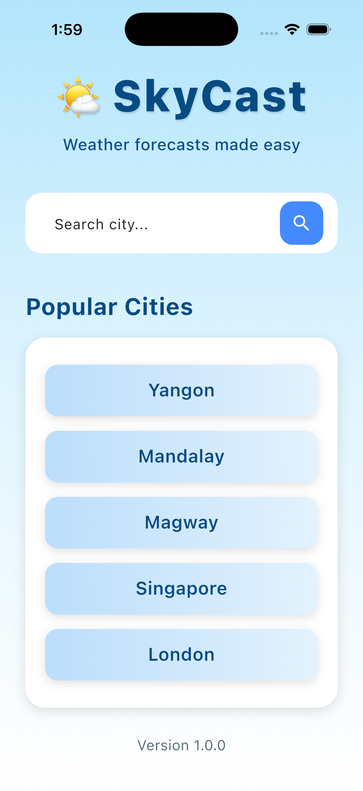
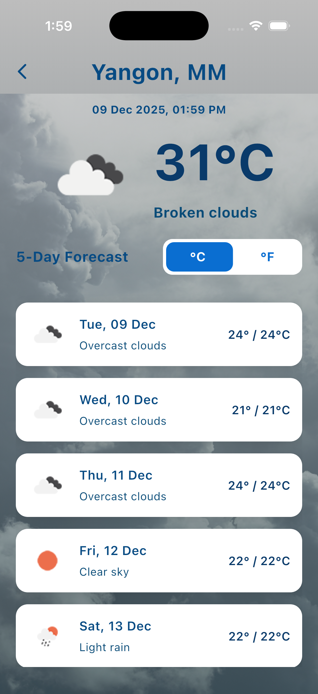

# SkyCast 🌤️

> SkyCast is a modern **weather forecast app** built with Flutter, allowing users to search weather information for any city and view a 5-day forecast.


## 🌐 Demo Web App

Try the live web version of SkyCast here:

👉 **https://skycast-webapp.vercel.app/**


## 📱 Demo APK

You can download the demo APK here:  
[Download SkyCast APK](https://drive.google.com/file/d/1TCRzRvyFKtrhT5K7x-ouVdAk_mOpODQD/view?usp=share_link)

---

## 🖼 Screenshots

<p>




</p>


---

## 🛠️ Tech Stack

| Feature            | Implementation     |
| :----------------- | :----------------- |
| State Management   | Riverpod           |
| API Service        | Dio                |
| Architecture       | MVVM               |
| UI                 | Flutter + Material |

---

## 🔥 Features

- Search for weather information of any city  
- View **current weather conditions** including temperature and weather description 🌡️💨  
- **5-day weather forecast** 📅  
- Toggle between **Celsius (°C) and Fahrenheit (°F)**  


---

## ⚙️ API

SkyCast uses **OpenWeatherMap API** to fetch weather data.  

- Base URL: `https://api.openweathermap.org`  
- API Docs: [openweathermap.org](https://openweathermap.org/api)  
- Supported endpoints:
  - Geocoding: `/geo/1.0/direct?q={city_name}&appid={API_KEY}`
  - Current weather: `/data/2.5/forecast?lat={lat}&lon={lon}&appid={API key}`  

> Note: Replace `{API_KEY}` with your own API key from OpenWeatherMap.

---

## 📝 Usage

1. **Clone the repository**  

```bash
git clone https://github.com/thihas0ehtet/sky-cast
```

2. **Install dependencies**  

```bash
flutter pub get
```

3. **Add OpenWeatherMap API key**  
   - Create a `.env` file in the project root 
   - Add:  
     ```
     WEATHER_API_URL=https://api.openweathermap.org
     WEATHER_API_KEY=your_api_key_here
     ```
```bash
dart run build_runner build --delete-conflicting-outputs
```

4. **Run the app**  

```bash
flutter run
```
